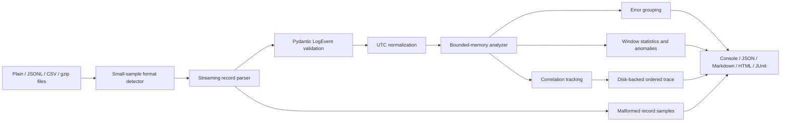

# Distributed Log Intelligence

[](https://github.com/German4341374/distributed-log-intelligence/actions/workflows/ci.yml)
[](https://www.python.org/)
[](LICENSE)

`distributed-log-intelligence` is a local-first command-line tool for support and
operations engineers who need to investigate logs from several services without
uploading confidential data. It streams plain text, JSON Lines, CSV, and gzip files,
normalizes timestamps to UTC, groups recurring failures, finds bursts and anomalous time
windows, and reconstructs cross-service flows by correlation ID.

## Highlights

- Streams one or many files instead of loading the complete data set into memory.
- Detects plain text, JSONL, and CSV; reads gzip inputs transparently.
- Recognizes common timestamp fields and normalizes aware or naive values to UTC.
- Normalizes DEBUG, INFO, WARNING, ERROR, and CRITICAL levels.
- Groups error messages after replacing volatile UUIDs, IPs, timestamps, IDs, and numbers.
- Tracks correlation IDs and builds ordered service chains with a disk-backed trace index.
- Finds threshold-based error bursts and z-score anomalies in configurable time windows.
- Compares baseline and current periods for new, resolved, and increasing errors.
- Masks emails, IPv4 addresses, phone numbers, bearer tokens, API keys, and secrets.
- Exports JSON, Markdown, self-contained HTML, and JUnit XML reports.
- Handles malformed records explicitly and returns automation-friendly exit codes.

## Architecture



The parser is an iterator. Analysis memory grows with distinct retained groups, services,
correlation IDs, and time windows—not with the number of input records. Trace ordering uses a
temporary SQLite database so a large correlated flow does not have to be sorted in RAM. See
[architecture.md](docs/architecture.md) for the detailed memory model and trade-offs.

## Requirements

- Python 3.12 or newer (3.14 is used by the container)
- [`uv`](https://docs.astral.sh/uv/) for the documented development workflow
- Docker, optionally, for the isolated CLI image
- GNU Make, optionally; every Make target maps to a documented `uv` command

The project is fully local and works on Linux or Windows through WSL2.

## Quick start

```bash
git clone https://github.com/German4341374/distributed-log-intelligence.git
cd distributed-log-intelligence
uv sync --locked --extra dev

uv run distributed-log-intelligence generate-demo demo.jsonl --lines 10000
uv run distributed-log-intelligence analyze demo.jsonl --output report.html
```

Generate and analyze gzip data:

```bash
uv run dli generate-demo demo.csv --format csv --lines 50000 --gzip
uv run dli analyze demo.csv.gz --window-minutes 5 --top 15 --output report.json
```

## Commands

### Analyze several files

```bash
uv run dli analyze gateway.log orders.jsonl payments.csv.gz \
  --default-timezone Europe/Berlin \
  --window-minutes 10 \
  --burst-threshold 20 \
  --output incident-report.md
```

Use `--fail-on-malformed` or `--fail-on-anomaly` when a CI job should fail on those
conditions.

### Compare periods

Baseline files are positional. Repeat `--current` for each current-period file:

```bash
uv run dli compare logs/baseline-1.jsonl logs/baseline-2.jsonl \
  --current logs/current-1.jsonl \
  --current logs/current-2.jsonl \
  --output comparison.html
```

### Trace a request across services

```bash
uv run dli trace demo-00000042 gateway.log orders.jsonl payments.csv.gz \
  --max-events 2000 \
  --output trace.json
```

Trace matches exact correlation IDs. Messages in the result are masked before output.

### Redact a file

```bash
uv run dli redact production.log production.redacted.log
uv run dli redact archive.jsonl.gz archive.redacted.jsonl.gz
```

The source is never modified. Existing destinations require `--overwrite`.

### Validate input

```bash
uv run dli validate gateway.log api.jsonl data.csv.gz --output validation.xml
echo $?  # 0 for fully valid input, 1 when malformed records exist
```

### Generate deterministic demo logs

```bash
uv run dli generate-demo demo.log --format plain --lines 1000 --seed 42
uv run dli generate-demo demo.jsonl --format jsonl --lines 1000
uv run dli generate-demo demo.csv --format csv --lines 1000 --gzip
```

All demo identities, addresses, and events are synthetic.

## Supported input shape

JSONL and CSV recognize aliases for these fields:

| Canonical field | Recognized examples |
|---|---|
| timestamp | `timestamp`, `@timestamp`, `time`, `datetime`, `date` |
| level | `level`, `severity`, `loglevel`, `log_level` |
| service | `service`, `app`, `application`, `component`, `logger` |
| message | `message`, `msg`, `event`, `text` |
| correlation ID | `correlation_id`, `trace_id`, `request_id` and compact/hyphenated forms |

Plain input uses this shape:

```text
2026-01-15T08:00:00Z ERROR service=payments correlation_id=req-0042 database timeout after 5000 ms
```

Naive timestamps are interpreted with `--default-timezone` and then converted to UTC. Numeric
Unix timestamps in seconds or milliseconds are accepted in JSONL and CSV.

## Reports and exit codes

The output extension selects JSON (`.json`), Markdown (`.md`), HTML (`.html`), or JUnit XML
(`.xml`). `--report-format` can override it when `--output` is present.

| Exit code | Meaning |
|---:|---|
| 0 | Command completed and configured quality gates passed |
| 1 | Validation found malformed data, trace found no match, or an enabled analysis gate failed |
| 2 | Usage, input, timestamp, filesystem, or configuration error |

## Development

```bash
make setup
make lint
make test
make build
make demo
make benchmark
```

Equivalent commands without Make:

```bash
uv sync --locked --extra dev
uv run ruff format --check .
uv run ruff check .
uv run mypy src benchmarks
uv run pytest
uv build
```

## Docker

```bash
docker build --target runtime -t distributed-log-intelligence:0.1.0 .
docker run --rm distributed-log-intelligence:0.1.0 --version

docker run --rm -v "$PWD/logs:/data:ro" \
  distributed-log-intelligence:0.1.0 \
  analyze /data/app.jsonl
```

The runtime image uses a multi-stage build, contains no compiler toolchain, and runs as UID
10001. Mount production logs read-only. The image does not make network requests.

## Detection details and limitations

- Error bursts are absolute threshold checks per observed window.
- Statistical anomalies use a population z-score and require at least six observed windows.
- Empty time windows are not synthesized. Non-stationary, seasonal, sparse, or multimodal logs
  can make z-scores misleading; this is a triage signal, not an incident verdict.
- Message grouping is deterministic but heuristic. Aggressive numeric replacement can merge
  errors whose only meaningful difference is a number.
- Format detection reads at most the first five non-empty lines; extension-based detection wins.
- Invalid UTF-8 bytes are replaced during text decoding and the affected row may still parse.
- The redactor is best-effort pattern matching, not a data-loss-prevention guarantee.
- Correlation tracing is exact and does not infer causality when IDs are missing or reused.

See [data-handling.md](docs/data-handling.md) for malformed-record behavior and
[privacy.md](docs/privacy.md) before using the tool with confidential logs.

## Benchmarking

The benchmark generator creates deterministic temporary JSONL files, runs the same streaming
analyzer used by the CLI, and records elapsed time, throughput, and Python peak allocations.

```bash
uv run python benchmarks/run_benchmark.py --sizes 10000 50000 200000 --repeats 3
```

Committed results in [benchmark-results.md](docs/benchmark-results.md) are included only after
running that exact revision. Results are environment-specific and are not performance promises.

## Security notes

- Processing is local; the application has no telemetry, analytics, HTTP client, or upload path.
- Output examples and malformed-line previews are masked.
- Raw input remains sensitive. Protect source files, report files, temporary directories, shell
  history, and CI artifacts according to the same data classification.
- A report may contain business-sensitive service names and message structure even after PII
  masking.
- Run the container without network access for additional isolation: `--network none`.

Security reports are handled according to [SECURITY.md](SECURITY.md).

## Project layout

```text
src/distributed_log_intelligence/  CLI, parsing, analysis, privacy, and reports
tests/                             Unit, integration, CLI, and fixture tests
benchmarks/                        Deterministic streaming benchmark
docs/                              Architecture, privacy, data handling, results
.github/workflows/                 Quality, test, benchmark, build, and container CI
```

## Next steps

- Optional on-disk aggregation for extremely high-cardinality time ranges.
- Pluggable parsers for vendor-specific formats without expanding the core schema.
- Robust median/MAD and seasonal baselines for anomaly detection.
- Optional IPv6 and organization-specific identifier masking profiles.
- Reservoir sampling for representative error examples.

## License

Distributed under the [MIT License](LICENSE).
